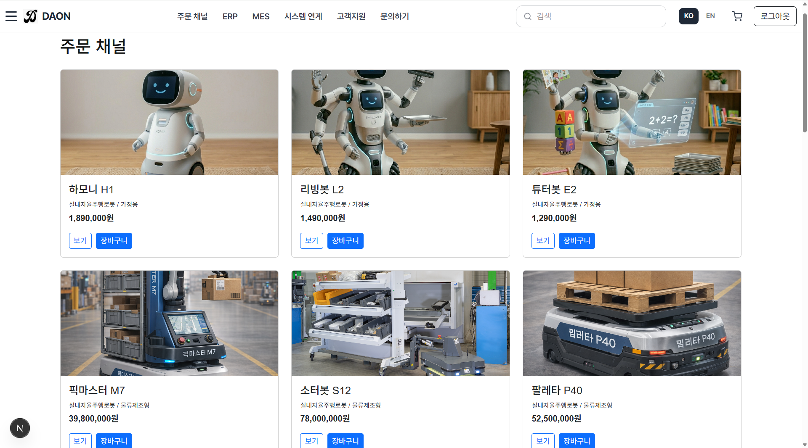
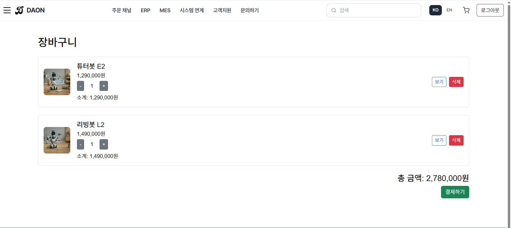
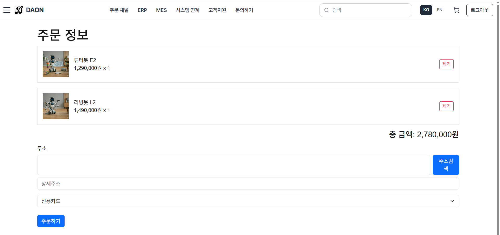
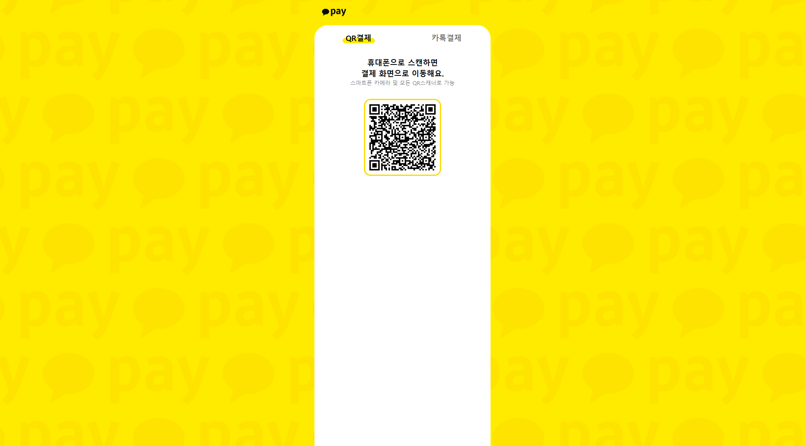
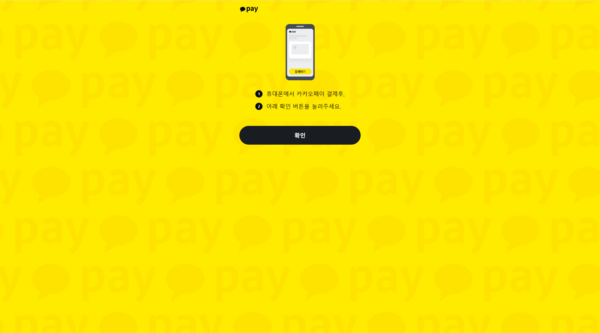

# DAON – Integrated Commerce Platform (Frontend)

Next.js 기반으로 개발한 **통합 쇼핑몰 프론트엔드 프로젝트**입니다.  
Spring Boot 백엔드(ERP / MES / 결제 시스템)와 연동하여 상품 조회, 장바구니, 주문, 카카오페이 가결제 흐름을 구현했습니다.

단순 쇼핑몰 구현을 넘어,  
**ERP 및 MES 확장을 고려한 통합 상거래 플랫폼**을 목표로 개발했습니다.

---

## 📌 Project Overview

DAON은 사용자 관점의 주문형 쇼핑몰 기능과  
관리/운영 관점의 ERP·MES 확장 가능성을 함께 고려한 프로젝트입니다.

프론트엔드는 Next.js 기반으로 구현되었으며,  
백엔드 API와 연동하여 주문 및 결제 프로세스를 처리합니다.

### 핵심 목표
- 쇼핑몰 주문 흐름 구현
- 카카오페이 결제 연동 경험 확보
- ERP / MES와 연결 가능한 구조 설계
- 실제 서비스와 유사한 결제 프로세스 이해

---

## 🚀 Tech Stack

### Frontend
- **Next.js (App Router)**
- **TypeScript**
- React
- React-Bootstrap

### Features / APIs
- LocalStorage 기반 장바구니 관리
- 카카오페이 결제 연동
- 다음(카카오) 우편번호 API

### Backend
- Spring Boot REST API 연동
- 결제 승인 / 주문 처리 API 통신

---

## ✨ Main Features

### 🛍 상품 및 주문
- 상품 목록 조회
- 장바구니 추가 / 삭제
- 수량 기반 총 금액 자동 계산
- 배송지 입력
- 주소 검색(다음 우편번호 API)
- 주문 정보 입력 및 결제 요청

### 💳 카카오페이 가결제 연동
- Ready → Redirect → Approve 흐름 구현
- 결제 성공 시 백엔드 승인 처리
- 결제 실패 / 취소 대응 구조 설계

### 🔗 백엔드 연동
- `/api/payments/kakaopay/ready` 호출
- redirect URL 수신 후 카카오 결제창 이동
- success 페이지에서 `pg_token` 전달 후 approve API 호출
- 결제 승인 완료 후 결과 화면 처리

---

## 🔄 Payment Flow

```text
1. 사용자가 상품을 장바구니에 담는다
2. 주문 페이지에서 주소 및 결제수단을 입력한다
3. 프론트엔드에서 백엔드 Ready API를 호출한다
4. 백엔드가 카카오페이 결제 URL을 반환한다
5. 사용자가 카카오 결제창에서 결제를 진행한다
6. 결제 완료 후 success 페이지로 리다이렉트된다
7. pg_token을 백엔드 Approve API로 전달한다
8. 최종 결제 승인 및 완료 처리가 이루어진다

🖼 Screenshots
1. 주문 채널

상품 목록을 조회하고, 상세보기 및 장바구니 담기 기능을 제공하는 화면입니다.


2. 장바구니

선택한 상품을 확인하고 수량 조절, 삭제, 총 금액 확인이 가능한 화면입니다.


3. 주문하기

배송지 입력과 결제수단 선택 후 실제 주문을 진행하는 화면입니다.


4. 카카오 결제 화면

카카오페이 결제를 진행하는 단계의 화면입니다.


5. 카카오 결제 과정

사용자가 QR 또는 카카오 결제 흐름을 통해 결제를 진행하는 화면입니다.


6. 카카오 결제 완료

결제 완료 후 카카오페이에서 확인 가능한 완료 화면입니다.


🛠 Getting Started
1. Install dependencies
npm install
2. Run development server
npm run dev
3. Open in browser
http://localhost:3000

백엔드 서버(http://localhost:9999)가 함께 실행 중이어야
주문 및 결제 기능이 정상적으로 동작합니다.

⚠️ Troubleshooting

개발 과정에서 아래와 같은 이슈를 해결했습니다.

카카오페이 400 BAD_REQUEST

도메인 미등록 문제 해결

결제 요청 시 amount 누락 오류 디버깅

Next.js ↔ Spring Boot API 연동 문제 해결

환경변수 설정 오류 해결

모듈 설정 및 실행 환경 문제 해결

🎯 Project Purpose

쇼핑몰 + ERP / MES 확장이 가능한 통합 구조 설계

외부 결제 API 연동 경험 축적

실제 상용 서비스 흐름과 유사한 결제 프로세스 구현

프론트엔드와 백엔드 간 API 협업 구조 이해

🔮 Future Improvements

주문 내역 조회 페이지 추가

결제 상태 UI 개선

출고 / 재고 관리 화면과 연동

관리자 페이지 확장

다국어 지원 (한국어 / 영어)

👩‍💻 Author

DAON Integrated Commerce Platform Frontend Project